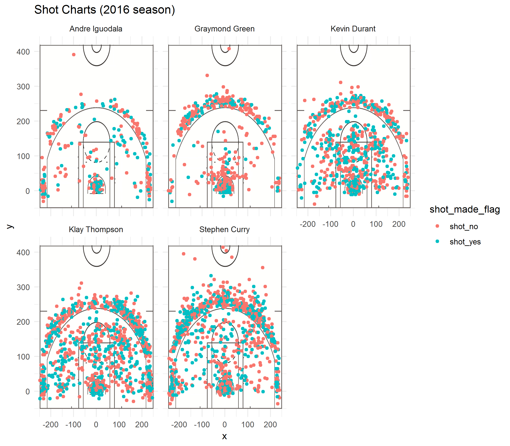

workout1
================
Poorvi Acharya
March 12, 2019

Infighting amongst the golden state warriors? Who will rise to the top of the top?
==================================================================================

Background
==========

Kevin Durant
------------

<center>

</center>
Kevin Durant is 6 ft 9 inches, and is known for his prodigous scoring ability. Off the court, Durant is one of the highest-earning basketball players in the world, due in part to endorsement deals with companies such as Foot Locker and Nike. When Durant was a baby, his father left; His parents eventually divorced, and Durant's grandmother Barbara Davis helped raise him. By age 13, his father reentered his life and traveled the country with him to basketball tournaments. Durant has a sister, Brianna, and two brothers, Tony and Rayvonne. Coming from such a broken home, it is truly imperssive how successful Durant has become.

Stephen Curry
-------------

<center>

</center>
Standing at 6 feet 3 inches tall and weighing 190 pounds (86 kg), Curry plays almost exclusively at the point guard position and has career averages of 23.1 points, 6.8 assists, 4.4 rebounds, and 1.8 steals per game. Curry is a six-time NBA All-Star, he has been named the NBA Most Valuable Player (MVP) twice and won three NBA championships with the Warriors. Many players and analysts have called him the greatest shooter in NBA history. He is credited with revolutionizing the game of basketball by inspiring teams to regularly employ the three-point shot as part of their winning strategy. He was born in Akron, Ohio while his father, Dell Curry, was a member of the Cleveland Cavaliers. He grew up in Charlotte, North Carolina, where his father spent most of his NBA career with the Charlotte Hornets. He is 6 ft 3 inches.

Draymond Green
--------------

<center>

</center>
Draymond Green plays primarily at the power forward position, is a three-time NBA champion and a three-time NBA All-Star. In 2017, he won the NBA Defensive Player of the Year. Green, who often plays significant minutes for the Warriors as an undersized center in their Death Lineup, has been cited as one of the leaders in an emerging trend in the NBA of versatile frontcourt players capable of playing and defending multiple positions, making plays for teammates and spacing the floor. Though he is considered undersized for a power forward at 6 feet 7 inches, Green is a versatile defender, capable of guarding all 5 positions as both an interior and perimeter defender. Green studies opponents' habits, and leverages his preparation along with his muscular frame and lower-body strength, and is capable of generating rebounds, steals and blocks.

He is 6 ft 7 in.

Klay Thompson
-------------

<center>

</center>
He is credited as one of the greatest shooters in NBA history. He is a five-time NBA All-Star, a two-time All-NBA Third Team honoree, and a three-time NBA champion. In 2014, Thompson and teammate Stephen Curry set a then NBA record with 484 combined three-pointers in a season, earning the pair the nickname the "Splash Brothers". Thompson was born in Los Angeles to Julie and Mychal Thompson. His mother was a volleyball player in college, and his dad was the first overall pick of the 1978 NBA draft. Thompson is an efficient shooter, particularly from range, as well as an elite free-throw shooter. He relies upon a shooting form that has been described as "textbook" and "picture-perfect". Though he is capable of handling the ball in the Warriors offense, Thompson is primarily a catch-and-shoot player, taking advantage of back-cuts and screens set by teammates to make space for his exceptionally accurate quick-release shot.

He is 6 ft 7.

Andre Iguodala
--------------

<center>

</center>
Andre plays as swingman, and was an NBA All-Star in 2012 and has been named to the NBA All-Defensive Team twice. Iguodala won an NBA championship with the Warriors in 2015, when he was named the NBA Finals Most Valuable Player. Iguodala helped the Warriors win two more championships in 2017 and 2018. He was also a member of the United States national team at the 2010 FIBA World Championship and 2012 Summer Olympics, winning the gold medal both times. He is the son of Linda Shanklin. His older brother, Frank, played for Lake Land College in Mattoon, Illinois, and Dayton. His mother is African American, while his father is Nigerian. Growing up, Iguodala rooted for the Chicago Bulls, and he cites Michael Jordan as the player he looked up to. He is 6 ft 6.

Data
====

Below is a comparison of shot charts the top scoring players in 2018 for the golden state warriors.



Analysis
========

Durant and Curry have some of the best distribution on the court, as reflected in their high overall shot rate. Comparing Durant and Curry, Curry has a slightly higher range, whereas Durant plays a more conservative field. However, what Durant lacks in 3 pointers he makes up for high score in 2 pointers. Similarly, Curry whose 3 point score is not great, has an excellent 2 point score. Looking at Iguodala, we see that while although he clearly plays a very small field, if we examine the score percentage, he outclasses the other 4 by a wide margin in the 2 point category. Perhaps safe is best, as reflected in his low 3 point score. However, his overall score is quite high compared to the other 4. Perhaps the most abysmal and disheartening range is that of Greens. Many misses in even the closest of space, inconsistent, and his score percentage in both the 2 point and 3 point categories are lackluster in comparison to the others. Perhaps its time for retirement?

``` r
library(dplyr)
```

    ## 
    ## Attaching package: 'dplyr'

    ## The following objects are masked from 'package:stats':
    ## 
    ##     filter, lag

    ## The following objects are masked from 'package:base':
    ## 
    ##     intersect, setdiff, setequal, union

``` r
shots_data <- read.csv("../data/shots-data.csv")
```

``` r
x <- select(shots_data, c('name', 'shot_made_flag', 'shot_type'))
```

``` r
x[x$shot_type == "2PT Field Goal",] %>%
  group_by(name) %>%
  dplyr::summarise(total = n(), made = sum(shot_made_flag == "shot_yes"), percentage = made / total)
```

    ## # A tibble: 5 x 4
    ##   name           total  made percentage
    ##   <fct>          <int> <int>      <dbl>
    ## 1 Andre Iguodala   210   134      0.638
    ## 2 Graymond Green   346   171      0.494
    ## 3 Kevin Durant     643   390      0.607
    ## 4 Klay Thompson    640   329      0.514
    ## 5 Stephen Curry    563   304      0.540

``` r
x[x$shot_type == "3PT Field Goal",] %>%
  group_by(name) %>%
  dplyr::summarise(total = n(), made = sum(shot_made_flag == "shot_yes"), percentage = made / total)
```

    ## # A tibble: 5 x 4
    ##   name           total  made percentage
    ##   <fct>          <int> <int>      <dbl>
    ## 1 Andre Iguodala   161    58      0.360
    ## 2 Graymond Green   232    74      0.319
    ## 3 Kevin Durant     272   105      0.386
    ## 4 Klay Thompson    580   246      0.424
    ## 5 Stephen Curry    687   280      0.408

``` r
x %>%
  group_by(name) %>%
  dplyr::summarise(total = n(), made = sum(shot_made_flag == "shot_yes"), percentage = made / total)
```

    ## # A tibble: 5 x 4
    ##   name           total  made percentage
    ##   <fct>          <int> <int>      <dbl>
    ## 1 Andre Iguodala   371   192      0.518
    ## 2 Graymond Green   578   245      0.424
    ## 3 Kevin Durant     915   495      0.541
    ## 4 Klay Thompson   1220   575      0.471
    ## 5 Stephen Curry   1250   584      0.467

Conclusion
==========

It is difficult to ascertain who is the best amonsgst the best, the champion of the golden state warriors. Some players have their strengths and weaknesses. Some choose to employ different strategies than others. Durant and Curry play a wider field at the cost of fewer easy 2 poiters. Igoudala forsakes 3 pointers for a stable and reliable strategy of staying close to the hoop. Thompson is like a Durant that is yet to develop. His playing style is a bit immature for the wide range he tries to cover, so our advice is to pick one shot type and stick with it! But one thing we can all agree on is that Draymond Green should be fired.
